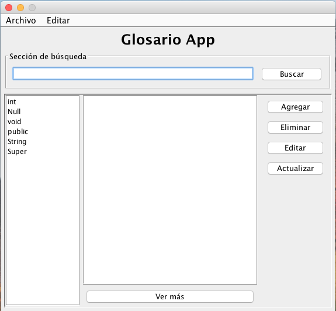
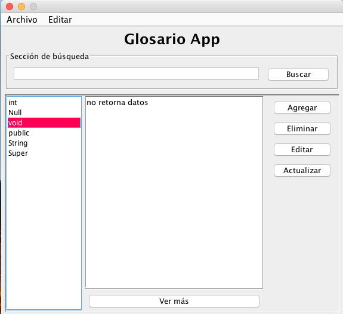
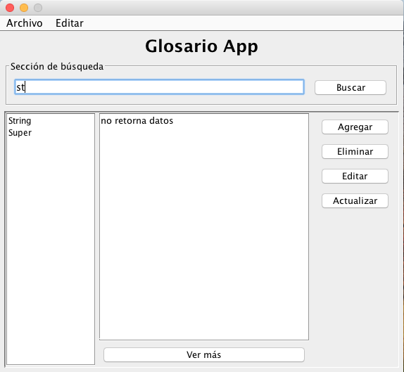
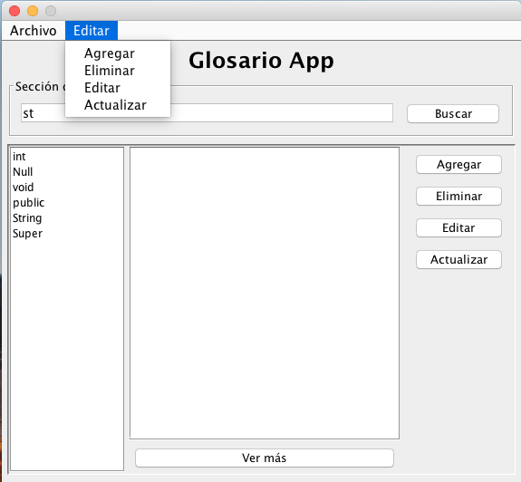
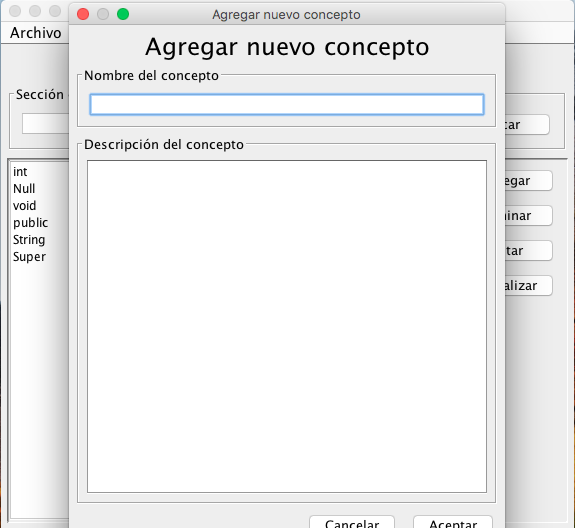
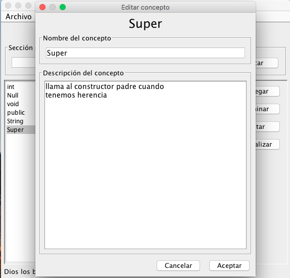
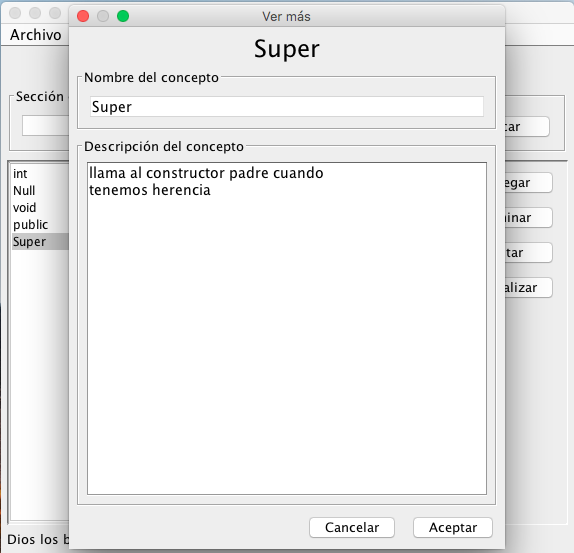

# Diplomado-Curso Java edición 2019 40hrs

Diplomado-curso-taller 100% práctico, desde declaración de variables, pasando por estructuras de control y desición, pasando a POO (Programación Orientada a Objetos), viendo sus detalles como Herencia, Polimorfismo. Continuando Con UI, ventanas, botones, entradas de texto, y culminando con db (SQLite).

**Participantes:**

 - José
 - Alejandro
 - Abraham
 - Guillermo
 - Fidel
 - Diego
 - Eduardo
 - Mateos

## Diapositivas:

[Material de apoyo](./Diplomado-JAVA.pdf)

## Vista de proyecto final









## Descarga

[Proyecto final](./GlosarioApp/dist/GlosarioApp.jar)

## Como ejecutar la app

``` cmd

java -jar ./GlosarioApp/dist/GlosarioApp.jar

```
